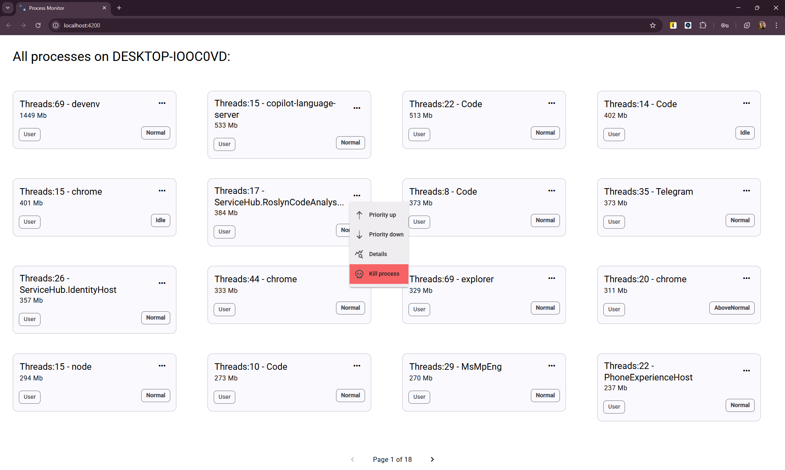
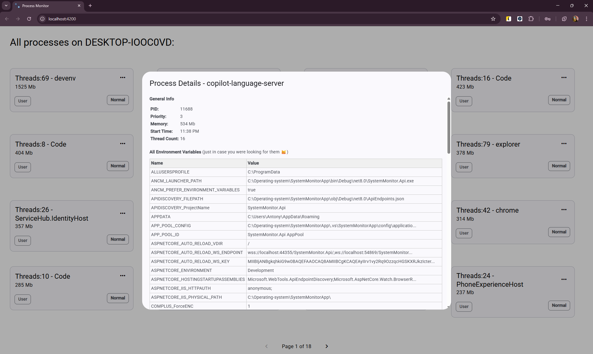

# 📘 Learning Plan: OS Fundamentals

## 🔧 1. Operating System Fundamentals

### 📚 Theoretical Topics

- [x] **Application structure**
  - [x] Understand .exe/.dll layout, Entry Point, PE format
  - [x] Explore Windows Registry and environment variables
- [x] **OS Resources & Handles**
  - [x] Learn about handles and resource management via WinAPI
- [x] **User interaction (Event Loop, Messages)**
  - [x] Understand message loops in WinForms/WPF
  - [x] Learn about Windows Messages (e.g., WM_COMMAND, GetMessage/DispatchMessage)
- [x] **Process and Thread Management**
  - [x] Thread creation, priorities, context switching
  - [x] Understand thread priority via `Thread.Priority`
- [x] **Thread synchronization primitives**
  - [x] Practice with Mutex, Semaphore, Monitor, lock, EventWaitHandle, Interlocked
- [x] **I/O (file access & concurrency control)**
  - [x] FileStream vs File, FileShare, file locks
- [x] **Memory management**
  - [x] Stack vs Heap, .NET GC, P/Invoke, VirtualAlloc/VirtualFree
- [x] **Windows vs macOS**
  - [x] Compare kernel architecture
  - [x] Understand memory & process management differences
  - [x] Study API surface differences (WinAPI vs POSIX)

### 💻 Practical Project: Process Monitor

⚠ Warning ⚠ 
Terminating important or system processes may cause system instability or shutdown. Proceed with caution! 

This is a visual interface for monitoring and managing processes on Windows and MacOS, built with .NET 8. 
Example of view ⬇️

**Features**
- Display all active processes in the system
- Show thread count, memory usage, and process name
- Change process priority
- Terminate processes (Kill process)
- View detailed process information and all system environment variables (not only for a specific process).
- Writes logs into the .txt file with support for concurrent access

**Technologies:**
- `System.Diagnostics`
- `Environment`
- `Thread`, `Task`, `lock`, `ThreadPriority`
- `FileStream`, `FileShare`
- `SignalR`
- `AutoMapper`
- `Angular`
- `.NET 8`
- `Process.GetProcesses()`
